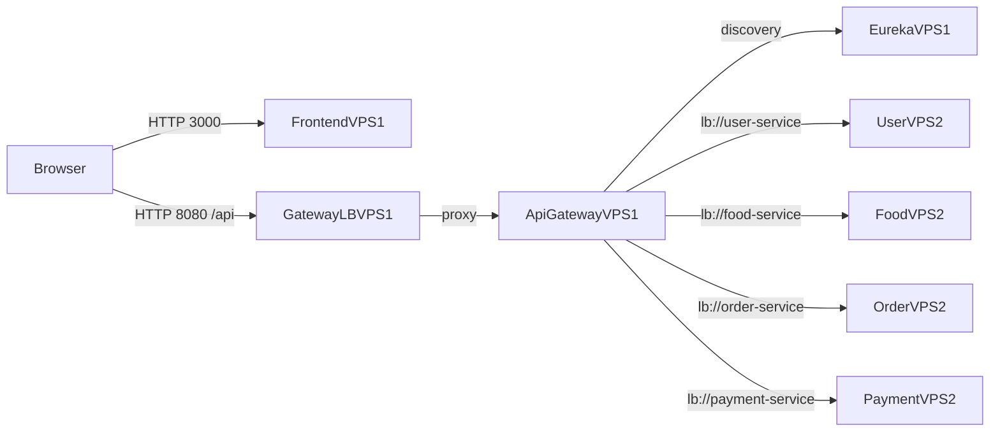

# Deploy Eureka (2 VPS) — Mini Food Ordering

## Mô hình

- **VPS1**: `eureka-server` + `api-gateway` + `gateway-lb` + `frontend`
- **VPS2**: `user-service` + `food-service` + `order-service` + `payment-service`



## Chuẩn bị firewall (khuyến nghị)

### VPS1
- Mở `3000/tcp` (frontend)
- Mở `8080/tcp` (gateway-lb)
- Mở `8761/tcp` (eureka dashboard) — nên giới hạn IP (admin/VPS2)

### VPS2
- Mở `8081-8084/tcp` **chỉ allow từ IP của VPS1**

## Deploy trên VPS1

```bash
cd backend
docker compose -f docker-compose.vps1.yml up -d --build
```

Kiểm tra:
- `http://<VPS1_IP>:8761` (Eureka dashboard)
- `http://<VPS1_IP>:8080/health` (Gateway health)

## Deploy trên VPS2

Trên VPS2, export biến trỏ về Eureka trên VPS1:

```bash
export EUREKA_SERVER_URL="http://<VPS1_IP>:8761/eureka"
```

Chạy:

```bash
cd backend
docker compose -f docker-compose.vps2.yml up -d --build
```

## Notes quan trọng (2 VPS + Docker bridge)

- Với cấu hình mặc định `preferIpAddress: true`, service sẽ đăng ký **IP của container** (172.x) vào Eureka.\n+  IP này **không truy cập được từ VPS1** nếu VPS1 và VPS2 là 2 máy riêng biệt.\n+  Nếu bạn gặp tình trạng Gateway discovery thấy instance nhưng gọi bị timeout, cần cấu hình để service đăng ký **host IP** (VPS2 IP) thay vì container IP.\n+\n+Gợi ý cách làm (tuỳ mức độ bạn muốn chuẩn):\n+- **Cách đơn giản cho demo (không scale mỗi service)**: chạy service trên VPS2 với `network_mode: host`.\n+- **Cách bài bản**: dùng Swarm/Kubernetes (overlay network) hoặc thêm reverse proxy per-service để publish nhiều instance.\n+
