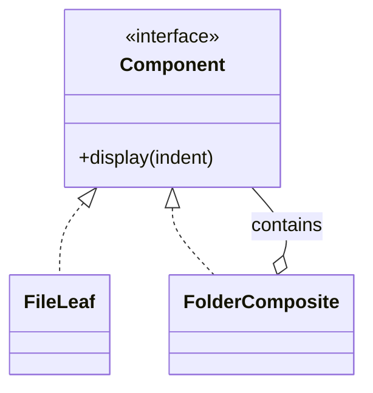
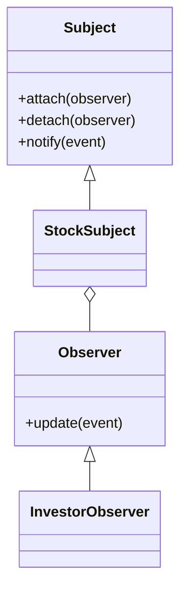
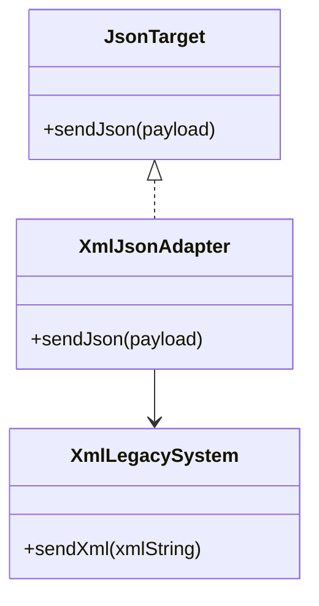

# Design Patterns Practice: Composite, Observer, Adapter

## Composite

```mermaid
classDiagram
    class Component {
      <<interface>>
      +display(indent)
    }

    class FileLeaf
    class FolderComposite

    Component <|.. FileLeaf
    Component <|.. FolderComposite
    FolderComposite o-- Component : contains
```

## Observer

```mermaid
classDiagram
    class Subject {
      +attach(observer)
      +detach(observer)
      +notify(event)
    }

    class Observer {
      +update(event)
    }

    class StockSubject
    class InvestorObserver

    Subject <|-- StockSubject
    Observer <|-- InvestorObserver
    StockSubject o-- Observer
```

## Adapter

```mermaid
classDiagram
    class JsonTarget {
      +sendJson(payload)
    }

    class XmlLegacySystem {
      +sendXml(xmlString)
    }

    class XmlJsonAdapter {
      +sendJson(payload)
    }

    JsonTarget <|.. XmlJsonAdapter
    XmlJsonAdapter --> XmlLegacySystem
```
